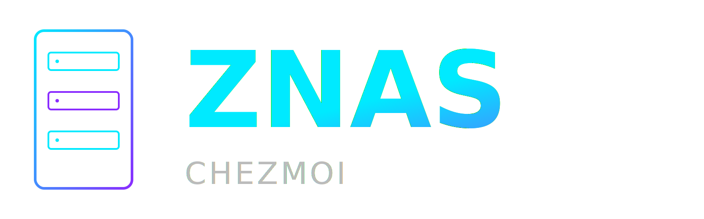

<p align="center">
  
</p>
<p align="center">
  <strong>A ZFS NAS management portal that gets out of your way.</strong><br/>
  Single binary. Secure. No database. No bloat.
</p>
<p align="center">
  
  
  
  
</p>

## Why ZNAS Chezmoi?

### Always Current, Zero Disruption

ZNAS is built like a modern browser — updates are continuous, silent, and non-disruptive. Like Chrome, you never have to think about versions: a single click applies the latest release in seconds while the portal keeps running. No package manager, no downtime, no breaking changes forced on you. Each update is a single self-contained binary that replaces itself atomically; if something ever goes wrong, the previous version is still there. ZNAS evolves constantly in the background so your NAS management stays ahead of the curve without ever interrupting your work.

---

Most NAS management software are slow to install, slow to load, and buried under layers of configuration. ZNAS Chezmoi is different:

- **One binary, zero dependencies** — compile once, copy anywhere, run. No Docker. No Node. No Python runtime.
- **Instant startup** — the portal is live in under a second. All static assets are embedded directly in the binary.
- **No database** — configuration lives in plain JSON files next to the binary. Back up with `cp`. Inspect with any text editor.
- **Advanced Features** 
  - Interlink mode to instantly switch between multiple ZNAS instance, simple push/pull between them
  - UPS Management with one click. Auto install and auto configure local UPS and let you decide actions on battery status
  - SMB Share but also, iSCSI and S3 Storage made simple !
  - Advanced capacity monitoring builtin with zero maintenance. See folder tree structure, capacity trend by pool or dataset over time
- **Guided setup wizard** — first-run installs missing system packages, registers a systemd service, detects existing ZFS pools, and creates your admin account. Start to finish in under five minutes.

Version 5.0.0 Full End-To-End DEMO on Youtube: [Version 5.0.0 DEMO](https://youtu.be/usFcZ15AyOs?si=U-neyJLCjkAfNHMc) \
Version 6.3.26 DEMO of Interlink and other new features! [Version 6.3.26 DEMO](https://youtu.be/UjaSBK0vWkk)


---

## Features

### Storage Management
- **Multi-Pool Support** — manage any number of ZFS pools side by side; switch between pools with a dropdown in the top bar and the Pool tab; last selection remembered per user across sessions
- **ZFS Pools** — create (Stripe / Mirror / RAIDZ1 / RAIDZ2) with configurable ashift, compression, and dedup; import existing pools; expand with new devices; upgrade pool feature flags; destroy
- **Pool Cache Devices** — add and remove ZFS L2ARC / ZIL devices per pool; separate ARC Level 1 (memory) tuning reads live `/proc/spl/kstat/zfs/arcstats` and writes `/etc/modprobe.d/zfs.conf` for persistence
- **Pool Fixer Wizard** — guided recovery for degraded, faulted, or suspended pools; automatically clears error state and brings offline disks back online in two steps
- **Disk Online / Offline** — manually take individual pool member disks offline or bring them back online without leaving the portal
- **Datasets** — full nested hierarchy with quota, refquota, reservation, record size, compression, sync, dedup, case sensitivity, and a free-text comment stored as a ZFS user property (`zfsnas:comment`)
- **ZVols** — create and manage ZFS block volumes (ZVols) with size, sync, compression, dedup, block size, and optional encryption; listed inline in the dataset table; used as iSCSI backing devices
- **Snapshots** — create, restore, clone, and delete; visual tree per dataset; snapshot list spans all pools
- **Scheduled Snapshots** — automated policies (hourly / daily / weekly / monthly) with configurable retention counts
- **ZFS Scrub** — trigger, monitor progress, stop, and schedule auto-scrubs (weekly / bi-weekly / monthly / every 2 or 4 months) at a configurable hour
- **ZFS Native Encryption** — create AES-256-GCM encrypted pools and datasets; keys are loaded automatically at startup so encrypted volumes mount without manual intervention
- **Encryption Key Management** — generate, import, export, and delete encryption keys from the Settings tab; export format is compatible with TrueNAS key exports, making migration between platforms straightforward; lock icons throughout the UI identify which pools and datasets are encrypted

### File Sharing
- **SMB Shares** — create and manage Samba shares with per-user read/write or read-only access; global SMB configuration (workgroup, server string, `[homes]` section); per-user home folder provisioning
- **NFS Shares** — Linux/macOS NFS exports with per-client CIDR and options (ro/rw, sync/async)
- **S3 Object Storage** — optional MinIO-backed S3 server; install with one click from Prerequisites; manage buckets (versioning, object lock, quota, anonymous access) and IAM users from the portal; TLS toggle included
- **iSCSI Sharing** — optional targetcli-fb backend; create iSCSI shares backed by ZVols; manage initiator host registry; enable from Prerequisites with one click
- **File Browser** — browse any dataset, SMB share, or NFS share path directly in the portal; admin can change ownership (`chown`) and permissions (`chmod`), optionally recursive; safe path traversal prevention

### Monitoring & Alerts
- **Physical Disks** — list all non-system disks with vendor, model, serial number, type, temperature, and SMART wearout (ATA + NVMe), color-coded by health
- **Pool Member Status** — per-disk health state (ONLINE / FAULTED / OFFLINE / etc.) shown inline in the pool view; presence detection for disks that have been physically removed
- **Pool Capacity Bar** — persistent capacity visualization at the top of every page with a pool selector when multiple pools are configured; per-dataset segments with hover tooltips
- **System Dashboard** — 24-hour RRD charts for CPU, memory (app + cache stacked), network (per interface), and disk I/O; live sparklines updated every few seconds
- **Capacity Trend** — dedicated page with stacked area charts; select any pool or dataset combination; dashed red usable-capacity ceiling line; time ranges from "since data" up to 5 years; backed by a 3-tier RRD (5-min/1-week, 30-min/1-month, daily/5-years)
- **UPS Management** — optional NUT install from Prerequisites; compact battery widget in top bar; UPS settings panel with visual battery gauge, metrics grid, and configurable shutdown policy (e.g. shut down at N% after M minutes on battery)
- **Hardware Info** — CPU core count and total RAM exposed via `/api/sysinfo/hardware`
- **Multi-Target Notifications** — six independent alert channels: Email (SMTP), ntfy, Gotify, Pushover, Syslog, and in-app WebSocket toasts; each channel has its own enable toggle and per-event subscriptions; all channels can be active simultaneously
- **Audit Health Events** — pool problem / recovery and disk problem / recovery transitions are written to the audit log automatically by the background health poller

### Administration
- **User Management** — four roles: `admin`, `standard`, `read-only`, `smb-only`; the `standard` role has 11 granular permission flags (terminal, file browser, pool/dataset management, SMB, NFS, iSCSI, snapshots, protection, settings, interlink, and sudo review); active session listing and remote kill; per-user UI preferences persisted across sessions
- **Certificate Management** — import and manage TLS certificates from the Settings tab; activate any cert and restart the portal in-place; self-signed cert auto-generated on first run
- **Audit Log** — append-only activity log with live sidebar widget and full log page (filterable by user, action, date); covers storage, sharing, auth, OS, and health events
- **Web Terminal** — browser-based PTY terminal (admin only), powered by xterm.js over WebSocket
- **OS Updates** — check for and stream-apply `apt` security updates from the portal
- **Binary Self-Update** — check for a newer release and apply it in-place over WebSocket with live progress output
- **Timezone Management** — set system timezone from the portal; falls back to `/usr/share/zoneinfo/` on minimal installs without `timedatectl`
- **Settings** — configure port, storage units (GB / GiB), SMTP, alert subscriptions, and read-only API key

---

## Requirements

| Requirement | Version |
|---|---|
| Debian | **13 (Bookworm) or later — recommended** |
| Ubuntu | 26.04 LTS or later (also supported) |
| Go (if you build from source) | 1.22 or later |
| `sudo` access without password | Required for ZFS, Samba/NFS management, and SMART commands (or [sudo hardening](SECURITY.md)) |

The following system packages are required. If any are missing, the **Prerequisites** tab will detect them and offer a guided installation:

| Package | Purpose |
|---|---|
| `zfsutils-linux` | `zpool` / `zfs` commands |
| `samba` | SMB file sharing |
| `nfs-kernel-server` | NFS file sharing |
| `smartmontools` | SSD wearout via `smartctl` |
| `nvme-cli` | NVMe wearout via `nvme smart-log` |
| `util-linux` | Disk listing via `lsblk` |
| `sudo` | Required to run privileged ZFS, Samba, NFS, and SMART commands |

---

## Installation

### Choose your installation type

| Installation type | Description | Guide |
|---|---|---|
| **Proxmox VM** | Run ZNAS inside a Debian VM on a Proxmox host; ZFS disks passed through via PCIe/HBA or virtio | [Wiki — Proxmox VM](https://github.com/macgaver/zfsnas-chezmoi/wiki/Installation-Proxmox-VM) |
| **Physical / Bare-metal** | Install directly on dedicated NAS hardware | [Wiki — Hardware](https://github.com/macgaver/zfsnas-chezmoi/wiki/Installation-Hardware) |
| **Quick installer (script)** | One-command automated setup on any supported Debian/Ubuntu host | [Option A below](#option-a--quick-installer-recommended) |
| **Build from source** | Clone the repo and compile; useful for development or custom builds | [Option B below](#option-b--build-from-source) |
| **Download binary** | Grab the latest release binary and run it directly | [Option C below](#option-c--download-a-release-binary) |

---

### Option A — Quick installer (recommended)

One command installs ZFS (if needed), creates a dedicated service account, downloads the latest binary, and registers a systemd service:

```bash
bash <(curl -fsSL https://raw.githubusercontent.com/macgaver/zfsnas-chezmoi/main/zfsnas-quickinstall-for-debian.sh)
```

> Run as root or with `sudo`. Supports Debian 13+ and Ubuntu 26.04+.

Once the installer completes, open your browser at the URL it prints (e.g. `https://<your-server-ip>:8443/setup`) and follow the setup wizard.

---

### Option B — Build from source

```bash
# 1. Clone the repository
git clone https://github.com/macgaver/zfsnas-chezmoi.git
cd zfsnas-chezmoi

# 2. Build the binary (all static assets are embedded at compile time)
go build -o zfsnas .

# 3. Run
./zfsnas
```

### Option C — Download a release binary

```bash
# Download the latest release for Linux amd64
curl -Lo zfsnas https://github.com/macgaver/zfsnas-chezmoi/releases/latest/download/zfsnas-chezmoi
chmod +x zfsnas
./zfsnas
```

### First-run setup (Options B and C)

Place the binary in a folder owned by a user with passwordless sudo access (you can restrict sudo to specific commands — see [SECURITY.md](SECURITY.md)). Then launch and open your browser at:

```
https://<your-server-ip>:8443/setup
```

> Accept the self-signed certificate warning — the cert is generated locally on your server and is used only to encrypt traffic between your browser and the portal.

The setup wizard will guide you through:

1. **Prerequisites** — detect and install missing system packages
2. **Systemd service** — optionally register `zfsnas.service` so the portal starts on boot
3. **ZFS pool** — detect and import existing pools, or create a new one
4. **Admin account** — create your first administrator

After setup, the portal is available at:

```
https://<your-server-ip>:8443
```

---

## Configuration

All configuration is stored in `./config/` relative to the binary (or override with `--config`):

```
config/
├── config.json            # port, first-run flag
├── users.json             # all portal users
├── shares.json            # SMB share definitions
├── nfs-shares.json        # NFS export definitions
├── alerts.json            # SMTP config + event subscriptions
├── snapshot-schedules.json
├── audit.log              # append-only, one JSON line per event
└── certs/
    ├── server.crt
    └── server.key
```

### CLI flags

| Flag | Default | Description |
|---|---|---|
| `--config` | `./config` | Path to the config directory |
| `--dev` | off | Serve static files from disk (development mode) |
| `--debug` | off | Enable verbose logging |

---

## Architecture

ZNAS Chezmoi is built to stay fast and simple as it grows:

- **Go 1.22+** — single statically-linked binary, cold start in milliseconds
- **Embedded frontend** — HTML, CSS, and JS compiled into the binary via `go:embed`; zero CDN calls in production
- **Alpine.js** — lightweight reactive UI with no build step, no npm, no bundler
- **gorilla/mux** — minimal HTTP routing
- **JSON file storage** — no database process to manage or back up
- **WebSocket streaming** — real-time terminal, package installation output, and system metrics without polling hacks
- **Background goroutines** — SMART refresh, health alerts, snapshot scheduling, and session cleanup run as lightweight goroutines inside the single process

---

## Security

For the full security model, sudo hardening guide, TLS configuration, and authentication details see **[SECURITY.md](SECURITY.md)**.

---

## License

GNU General Public License v3.0 — see [LICENSE](LICENSE) for details.
